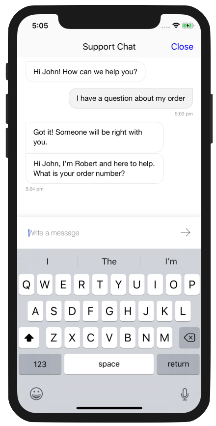

# Gladly Sidekick SDK

The Gladly iOS SDK makes it quick and easy to build a messaging experience in your iOS app. We provide powerful and customizable UI screens and elements that can be used out-of-the-box to connect with your users.

## Documentation
API documentation can be found at [https://developer.gladly.com/ios-sdk/](https://developer.gladly.com/ios-sdk/)

## Example application
A example application can be found [here](https://github.com/gladly/sidekick-ios-sdk/tree/master/Example) to get an idea how to work with the SDK. To run the example application:
1. Clone this repository.
1. Open the Example project in Xcode.
1. Drag in the latest release of the SDK as a dependency.
1. Replace the `appId` in `AppDelegate.swift` with a value given to you by Gladly.

## Releases
Releases of the SDK can be found under the [releases](https://github.com/gladly/sidekick-ios-sdk/releases) tab.

## Licence
TBD